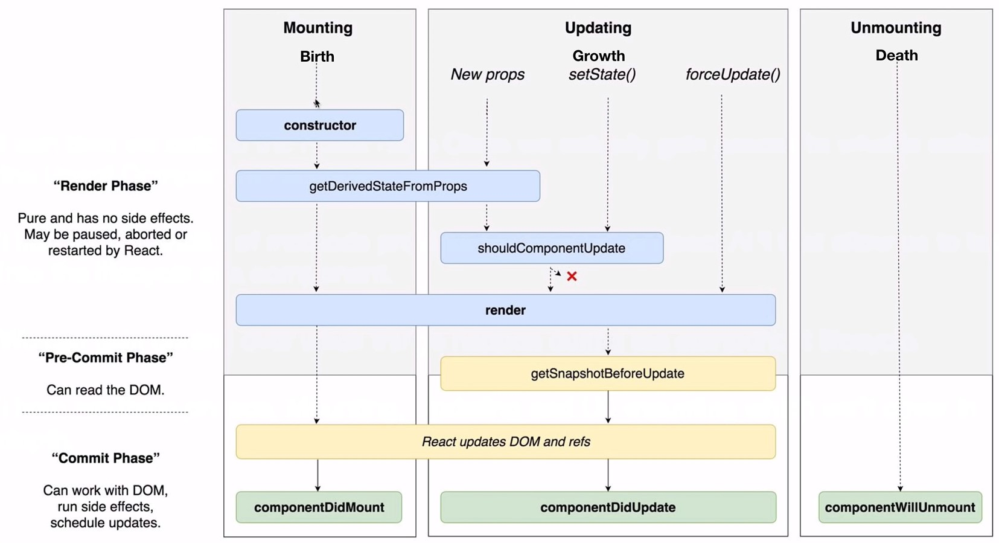

This project was bootstrapped with [Create React App](https://github.com/facebook/create-react-app).

## Available Scripts

In the project directory, you can run:

### `yarn start`

Runs the app in the development mode.<br />
Open [http://localhost:3000](http://localhost:3000) to view it in the browser.

# [React Lifecycle](https://reactjs.org/docs/react-component.html#the-component-lifecycle)
 **Every component in React has what we call a lifecycle. The Lifecycle is a a part of how our components operate under the hood. Being able to demonstrate understanding of the React Component Lifecycle by knowing how to use a few of the “Methods” that are provided by it, will help you understand how and why react behaves the way it does at times.**

 * When we use the React Base Class component from React (class Components) we gain access to The React Lifecycle
 * there are methods that allow us to tap into the lifecycle of a component, this is how we can gain control over when things happen during the component lifecycle
* The Lifecycle has three phases, Mounting, Updating, and Un-mounting 




### Mounting - Birth
* constructor  function is called and data is initialized
* can receive props and place them on our component as state
* render is invoked 
* after render componentDidMount will be invoked

### Updating/Growth
* new props will trigger updates to the child
* `this.setState` can be used to change the component’s state data, forcing a call to the render().
* shouldComponentUpdate is a method one could use here to stop a component from calling render if necessary.
* componentDidUpdate

### Un-Mounting
* Component is removed from the screen.
* componentWillUnmount is called and can be used for any clean up you may need to do.


# The React Lifecycle

## Review: Class Components

Here's the basic format you'll use when writing class components in React:

```javascript
class Lambda extends React.Component {
  constructor() {
    super(); // calls the constructor from React.Component, which intializes this.props
    // initialize state here
  }
  
  // lifecycle methods: componentDidMount, componentDidUpdate, componentWillUnmount, etc.
  
  render() {
    return <h1>Hello, {this.props.name}</h1>;
  }
}

export default Lambda;
```

## What are lifecycle methods? 

This may feel a bit complex at first, especially coming from the more streamlined Hooks approach. An easy way to understand the React lifecycle is that it's simply “when a component does what it does, and why". 

Just like a 🌿 or 🦔, a React component has three phases to its "lifecycle", and different things need to happen at each stage of life:
* Birth / mounting (`componentDidMount`)
* Growth / updating (`componentDidUpdate`)
* Death / unmounting (`componentWillUnmount`)

Sometimes they even render child components 🐣 too! But I may be overextending a questionable metaphor. Moving on...

## render()
If you were to implement the same component as a function and as a class, the JSX returned from `render()` is the same as what you return from the function component itself. 

Should be a pure function, meaning that it:
* does not modify component state 
* returns the same result each time it’s invoked
* does not directly interact with the browser.

## constructor()
For React class components, constructors are only used for two purposes:
* Initializing local state by assigning an object to `this.state`
* Binding event handler methods to an instance.

If you don’t initialize state and you don’t bind methods, you don’t need to implement a constructor for your React component. Remember that the `super()` call will happen even if you don't write a constructor.

For initialization, in the constructor we assign `this.state` directly. This is the only place we ever do this! In all other methods, use `this.setState()`. 

## Common lifecycle methods
**`componentDidMount`, `componentDidUpdate` and `componentWillUnmount`**

Together, these three lifecycle methods are roughly equivalent to the `useEffect()` hook.

### `componentDidMount`
invoked after React inserts the component into the DOM. Used to set a component’s state post-render

### `componentDidUpdate`
Takes arguments prevProps and prevState, and is called immediately after render is finished in each of re-render cycle. Use this for side effects like ajax reqeusts.

You should always add an if statement to make sure the relevant state/props have actually changed before doing anything here. (Otherwise you'll end up with infinite loops!)

### `componentWillUnmount`
perform any cleanup, e.g, removing event listeners, invalidating timers or cleaning up any DOM elements that were created in `componentDidMount` and `componentDidUpdate`

Use these to setup listeners, fetching data from an API and ultimately removing listeners before component is removed ("unmounted") from the DOM.

## Rarely used lifecycle methods:
* getDerivedStateFromProps
* shouldComponentUpdate
* getSnapshotBeforeUpdate

And some others that are deprecated now. Focus on just getting really comfortable with the 3 above, as you'll mainly just see those in most cases. If you're curious about learning all of these though, just take a few minutes for a full read of the API reference below.

## Understanding function components vs class components:
One simplified way to understand these different styles is that the `return` of a function component is the same as what we return from the `render()` method within a class component. In class components we manage state and side effects with these specifically named lifecycle methods, while in a function component we use hooks like useState() and useEffect() to do the same thing.


## No constructor
* Webpack initializes the constructor so we do not have to have it, this will work the same

        class EarthquakesContainer extends Component {
              state = {
                quakes: []
              };
        }


## Helpful Resources

[React.Component lifecycle methods - API reference](https://reactjs.org/docs/react-component.html) 

[Lifecycle method diagram](https://projects.wojtekmaj.pl/react-lifecycle-methods-diagram/)

[React component’s lifecycle - Medium article](https://medium.com/react-ecosystem/react-components-lifecycle-ce09239010df)

[Frontend CRUD with function and class components - by Megan Miller](https://www.notion.so/Basic-Frontend-CRUD-7e661baaac17451eb45776359b5f3d6e)

[Lifecycle Methods & Side Effects - by Megan Miller](https://www.notion.so/React-b4e93c23ea164f08a54622c3f6b40912?p=f37ae29e99564a89be8b0918c02ef974)

[this - by Megan Miller](https://www.notion.so/this-a82f4b18e0ba427b8e38e6b86daf645c)

[pokemon codesandbox](https://codesandbox.io/s/n3o80olx5m?file=/src/App.js)

[earthquakes](https://codesandbox.io/s/ry6p8j7qq4?file=/src/App.js)