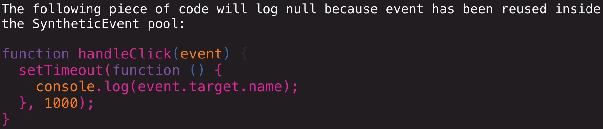
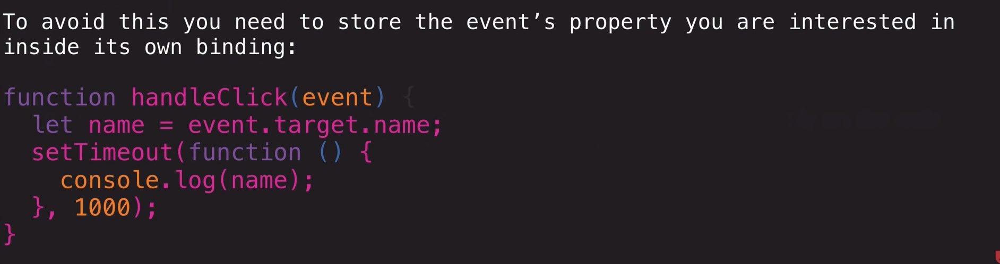

This project was bootstrapped with [Create React App](https://github.com/facebook/create-react-app).

## Available Scripts

In the project directory, you can run:

### `yarn start`

Runs the app in the development mode.<br />
Open [http://localhost:3000](http://localhost:3000) to view it in the browser.

# Class Components
* extends the Base React class, which gives us a bunch of functionality
`class FooComponent extends React.Component {}`
* has access to the React API and Lifecycle
* Can hold state using a constructor function
    * because we’re calling extends, we also need to call `super();` otherwise we won’t have access the this

            class FooComponent extends React.Component {
                constructor() {
                super();
                this.state = {};
                }

            }
* Render life-cycle method is how class components work
    * takes code and pipes it through the virtual DOM and engine, and uses it to create DOM elements
    * evething that is returned will go through it
    

                class FooComponent extends React.Component {
                        constructor() {
                        super();
                        this.state = {};
                        }
                        render() {
                            return <div>Hello, I am Foo Component</div>;
                        }

                }


# State
* component level storage object
* used to hold data
* can/should be set up on the constructor function
* state can be created read updated and deleted
* when state changes render gets called again
* state is passed around as props from component to component
* when state changes the props will also change (Reactive)

             constructor() {
                super();
                this.state = {};
                }


#How to Create a class commponet (CCR)
* Class- declare your class
* Constructor - constructor function
* Render

You can pull in the Component from React as a none default object
`import React, { Component } from 'react'`
`class App extends Component{}`


                class FooComponent extends React.Component {
                        constructor() {
                        super();
                        this.state = {
                            name: 'Shannon'
                        };
                        }
                        render() {
                            return <div>Hello,{this.state.name} I am Foo Component</div>;
                        }

                }


# State and Props
### State
* data that can be stored on the constructor
* just as the object that we reference on the this keyword
* Component that holds the state must be mounted
* mutable using the `setState` method
* when state changes `render()` gets called again


# EVENT HANDLING
* event object is wrapped inside a Synthetic Event object in React
*  events are pools so it can be used by DOM elements and their events
* The React event is different form the actual event object
* How React handles events



* events can be declared using arrow functions inside of class components
    * this will bind the function to the class as a method
    * this will automatically allow us to use the this keyword 


# Input
* the following code is a function that will log the change to the input field to the console

            handelInputChange = e => {
                console.log(e.target.value)
            }


# Class Components

## Review: JavaScript function prototypes and ES6 classes

Javascript has something called prototype-based inheritance, which is actually simpler than traditional class-based inheritance. So in JavaScript we use a style of object-oriented programming that makes use of constructor functions and prototypes rather than true classes. 

ES6 has changed things for the better, allowing inheritance without having to write a lot of messy, potentially confusing code. You'll almost always end up just writing ES6 classes because they're nicer and easier to understand, but just remember that your ES6 code compiles down to vanilla Javascript and it's the same prototype-based inheritance model at play. Let's take a look at how object-oriented programming works in JavaScript with and without ES6 classes, and try to demystify thigs a bit.

These are effectively the same:

```javascript
// plain old Javascript -- defining a constructor function
function Person(name, favoriteGenre) {
  this.name = name;
  this.genre = favoriteGenre;
}

// Define methods on the prototype:
Person.prototype.listen = function() {
  console.log(this.genre);
}

josh = new Person("josh", "jazz");
josh.listen();
```

```javascript
// ES6
class Person {
  constructor(name, favoriteGenre) {
    this.name = name;
    this.genre = favoriteGenre;
  }
  
  // ES6 abstracts away the prototype complexity so we can just define a class method right here:
  listen = () => {
    console.log(this.genre);
  }
}
josh = new Person("josh", "jazz");
josh.listen();
```

ES6 provides a syntax for object-oriented programming that is more familiar to coders from more traditional object-oriented languages (e.g., C++, Python, Ruby), but this syntax doesn't actually change the protoype-based inheritance model of JavaScript. 

In other languages, a class constructor creates an instance of the class, but a constructor in JavaScript is simply a function that returns an object. You've seen constructors like `String`, `Array` and `Object` that are built into JavaScript and we've also defined our own. The subtle differences between true class-based OOP and what we do in JavaScript won't make much difference for our purposes in React, but just know that Babel compiles your ES6 `class` down to a constructor function and definitions on its prototype.

In React, when we define a class component that `extends React.Component` we're basically just taking that base component class and extending it with our own custom behavior.

## React Class Component Syntax

React development originally focused on class components, written like this:

```javascript
class Lambda extends React.Component {
  constructor() {
    super(); // calls the constructor from React.Component, which intializes this.props
    // initialize state here
  }
  
  // lifecycle methods: componentWillMount, componentDidMount, componentWillReceiveProps, shouldComponentUpdate, componentWillUpdate, componentDidUpdate, and componentWillUnmount
  
  render() {
    return <h1>Hello, {this.props.name}</h1>;
  }
}

export default Lambda;
```

The base Component class includes built-in functionality for handling state and props, with specific methods that run at various points throughout the component's "lifecycle" (from mounting in your app, to updating, and eventually unmounting -- we'll study these in the next lecture).

The default `React.Component` constructor initializes `this.props` and other useful things -- feel free to look at the [React.Component constructor source code](https://github.com/facebook/react/blob/1d25aa5787d4e19704c049c3cfa985d3b5190e0d/packages/react/src/ReactBaseClasses.js#L22) if you're curious about what that `super()` call actually does.

## Are class components still relevant?

Function components were originally limited in their abilities, but React 16.8 introduced Hooks, allowing function components to "hook into" state and side effects without the need for class components.

Hooks streamline things a lot, and most developers prefer writing new components this way. But you'll also learn something new about the philosophy and principles behind React by learning the "old way" with class components.

And in the real world, you'll usually encounter applications with a mix of class and function components, so it'll help a lot in your career to fully understand both styles.

## Class components vs Function components:
  * In class components we use lifecycle methods to manage state and side effects. For function components we use Hooks.
  * Hooks cannot be used in class components! (and lifecycle methods are not used in function components)
  * Class components have just one state variable, an object with multiple keys
  * Function components have the option to store state in one or multiple variables, managed with `useState` and/or `useReducer`


## Helpful Resources
[How ES6 classes really work](https://medium.com/@robertgrosse/how-es6-classes-really-work-and-how-to-build-your-own-fd6085eb326a)

[Using arrow functions to avoid binding `this` in React](https://medium.com/@joespinelli_6190/using-arrow-functions-to-avoid-binding-this-in-react-5d7402eec64)

[React.Component documentation](https://reactjs.org/docs/react-component.html)

[State and Lifecycle](https://reactjs.org/docs/state-and-lifecycle.html)

  