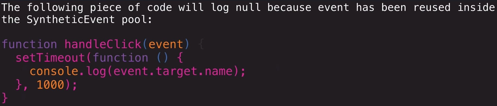
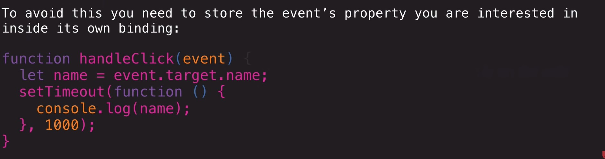

This project was bootstrapped with [Create React App](https://github.com/facebook/create-react-app).

## Available Scripts

In the project directory, you can run:

### `yarn start`

Runs the app in the development mode. 
Open [http://localhost:3000](http://localhost:3000) to view it in the browser.

# Class Components
* extends the Base React class, which gives us a bunch of functionality
`class FooComponent extends React.Component {}`
* has access to the React API and Lifecycle
* Can hold state using a constructor function
    * because we’re calling extends, we also need to call `super();` otherwise we won’t have access the this

            class FooComponent extends React.Component {
                constructor() {
                super();
                this.state = {};
                }

            }
* Render life-cycle method is how class components work
    * takes code and pipes it through the virtual DOM and engine, and uses it to create DOM elements
    * evething that is returned will go through it
    

                class FooComponent extends React.Component {
                        constructor() {
                        super();
                        this.state = {};
                        }
                        render() {
                            return 
Hello, I am Foo Component
;
                        }

                }

# State
* component level storage object
* used to hold data
* can/should be set up on the constructor function
* state can be created read updated and deleted
* when state changes render gets called again
* state is passed around as props from component to component
* when state changes the props will also change (Reactive)

             constructor() {
                super();
                this.state = {};
                }

#How to Create a class commponet (CCR)
* Class- declare your class
* Constructor - constructor function
* Render

You can pull in the Component from React as a none default object
`import React, { Component } from 'react'`
`class App extends Component{}`

                class FooComponent extends React.Component {
                        constructor() {
                        super();
                        this.state = {
                            name: 'Shannon'
                        };
                        }
                        render() {
                            return 
Hello,{this.state.name} I am Foo Component
;
                        }

                }

# State and Props
### State
* data that can be stored on the constructor
* just as the object that we reference on the this keyword
* Component that holds the state must be mounted
* mutable using the `setState` method
* when state changes `render()` gets called again

# EVENT HANDLING
* event object is wrapped inside a Synthetic Event object in React
*  events are pools so it can be used by DOM elements and their events
* The React event is different form the actual event object
* How React handles events

* events can be declared using arrow functions inside of class components
    * this will bind the function to the class as a method
    * this will automatically allow us to use the this keyword 

# Input
* the following code is a function that will log the change to the input field to the console

            handelInputChange = e => {
                console.log(e.target.value)
            }